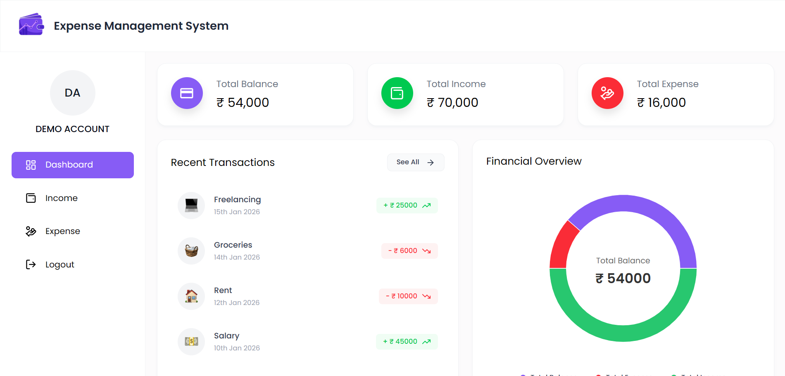
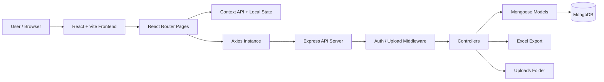

# Expense Management System


<div align="center">
  
</div>

<br />

Expense Management System is a full-stack MERN application that helps users track income, expenses, and overall balance through a responsive dashboard. It demonstrates practical MERN stack development with JWT authentication, RESTful APIs, MongoDB aggregation, protected routes, reusable React components, chart-based analytics, image upload, and Excel export.

This project is portfolio-ready for roles involving full-stack JavaScript, API integration, authentication, responsive UI development, database modeling, and performance-focused dashboard experiences.

## Project Links

| Resource | Link |
| --- | --- |
| Live | https://expense-management-system-ui-juxs.onrender.com/ |
| Portfolio Case Study | https://abhiraj-verma-portfolio.vercel.app/ |

## Key Features

- Secure user registration and login with JWT-based authentication.
- Password hashing with bcrypt before storing user credentials.
- Protected dashboard, income, expense, and user profile API routes.
- Income management with add, list, delete, and Excel download workflows.
- Expense management with add, list, delete, and Excel download workflows.
- Dashboard summary for total balance, total income, total expenses, recent transactions, last 30 days expenses, and last 60 days income.
- Responsive React UI built with Tailwind CSS and reusable components.
- Visual analytics using Recharts for pie, bar, and line chart presentations.
- Profile image upload using Multer and static file serving from the backend.
- Centralized frontend API handling with Axios interceptors and auth headers.
- Toast notifications and client-side validation for smoother user feedback.

## Tech Stack

| Layer | Technologies |
| --- | --- |
| Frontend | React 19, Vite, React Router, Tailwind CSS, Recharts, React Icons, React Hot Toast |
| Backend | Node.js, Express 5, JWT, bcryptjs, Multer, CORS, dotenv |
| Database | MongoDB, Mongoose |
| File Export | xlsx, Excel-compatible downloads |
| API Client | Axios with request and response interceptors |
| Tooling | ESLint, Nodemon, npm |

## Architecture Explanation

The application follows a clean MERN separation where the React frontend communicates with an Express REST API. The backend validates authentication through middleware, delegates business logic to controllers, and uses Mongoose models to read and write user-specific records in MongoDB.



### API Flow

1. The user logs in or signs up from the React frontend.
2. The backend validates credentials, hashes passwords during registration, and returns a JWT.
3. The frontend stores the token in `localStorage`.
4. The centralized Axios instance attaches `Authorization: Bearer <token>` to protected requests.
5. Express routes call the `protect` middleware to verify the token.
6. Controllers execute business logic and interact with MongoDB through Mongoose models.
7. The API returns JSON data for dashboard charts, transaction lists, and user information.

### Frontend

The frontend is organized around pages, reusable components, hooks, context, and utility modules. Dashboard screens use component composition for cards, charts, transaction lists, modals, and forms.

State management is intentionally lightweight:

- `UserContext` stores the authenticated user and exposes `updateUser` / `clearUser`.
- Page-level state handles income, expenses, loading flags, and modal visibility.
- `useUserAuth` fetches the current user and redirects unauthenticated users.
- `localStorage` persists the JWT between refreshes.

### Backend

The backend uses route-controller-model separation:

- `routes/` maps API URLs to controller functions.
- `controllers/` contains request handling and business logic.
- `models/` defines MongoDB schemas for users, income, and expenses.
- `middleware/` handles JWT protection and image upload.
- `config/` contains database connection logic.

### Database

MongoDB stores user accounts, income records, and expense records. Each income and expense document references `userId`, allowing the API to fetch data per authenticated user.

### Design Patterns and Best Practices Used

- Component-based frontend architecture.
- Centralized API path constants.
- Centralized Axios client with request and response interceptors.
- Middleware-based authentication for protected backend routes.
- Controller/model separation for maintainable backend logic.
- Mongoose schemas with timestamps for audit-friendly records.
- Environment-based configuration for local and deployed environments.

## Folder Structure

<details>
<summary>View Folder Structure</summary>

```text
Expense-management-system/
+-- backend/
|   +-- config/
|   |   +-- db.cjs
|   +-- controllers/
|   |   +-- authController.cjs
|   |   +-- dashboardController.cjs
|   |   +-- expenseController.cjs
|   |   +-- incomeController.cjs
|   +-- middleware/
|   |   +-- authMiddleware.cjs
|   |   +-- uploadMiddleware.cjs
|   +-- models/
|   |   +-- Expense.cjs
|   |   +-- Income.cjs
|   |   +-- User.cjs
|   +-- routes/
|   |   +-- authRoutes.cjs
|   |   +-- dashboardRoutes.cjs
|   |   +-- expenseRoutes.cjs
|   |   +-- incomeRoutes.cjs
|   +-- uploads/
|   +-- .env.example
|   +-- package.json
|   +-- server.cjs
+-- frontend/
|   +-- public/
|   +-- src/
|   |   +-- assets/
|   |   +-- components/
|   |   +-- context/
|   |   +-- hooks/
|   |   +-- pages/
|   |   +-- utils/
|   |   +-- App.jsx
|   |   +-- index.css
|   |   +-- main.jsx
|   +-- .env.example
|   +-- package.json
|   +-- vite.config.js
+-- README.md
```

</details>

## Beginner Setup Guide

### Prerequisites

- Node.js 18 or newer
- npm
- MongoDB installed locally or a MongoDB Atlas cluster
- Git

### 1. Clone the Repository

```bash
git clone <your-repository-url>
cd Expense-management-system
```

### 2. Configure the Backend

```bash
cd backend
npm install
cp .env.example .env
npm run dev
```

On Windows PowerShell, use:

```powershell
Copy-Item .env.example .env
```

The backend runs on:

```text
http://localhost:5000
```

### 3. Configure the Frontend

Open a new terminal:

```bash
cd frontend
npm install
cp .env.example .env
npm run dev
```

On Windows PowerShell, use:

```powershell
Copy-Item .env.example .env
```

The frontend runs on:

```text
http://localhost:5173
```

## Environment Variables

<details>
<summary>View Environment Variables</summary>

### Backend `.env`

```env
PORT=5000
MONGO_URL=mongodb://127.0.0.1:27017/expense-management-system
JWT_SECRET=replace_with_a_long_random_secret
CLIENT_URL=http://localhost:5173
```

### Frontend `.env`

```env
VITE_API_BASE_URL=http://localhost:5000
```

For production, set `VITE_API_BASE_URL` to the deployed backend URL and `CLIENT_URL` to the deployed frontend URL.

</details>

## MongoDB Setup

### Option 1: Local MongoDB

1. Install MongoDB Community Server.
2. Start the MongoDB service.
3. Use this backend environment variable:

```env
MONGO_URL=mongodb://127.0.0.1:27017/expense-management-system
```

### Option 2: MongoDB Atlas

1. Create a MongoDB Atlas cluster.
2. Create a database user.
3. Allow your IP address in Network Access.
4. Copy the connection string.
5. Replace `MONGO_URL` in `backend/.env`.

```env
MONGO_URL=mongodb+srv://<username>:<password>@<cluster-url>/expense-management-system
```

## Running Locally

Run the backend and frontend in separate terminals.

### Backend Commands

```bash
cd backend
npm install
npm run dev
```

### Frontend Commands

```bash
cd frontend
npm install
npm run dev
```

## Build and Deployment

### Frontend Deployment

Recommended platforms: Vercel, Netlify, Render Static Site.

```bash
cd frontend
npm run build
npm run preview
```

Deployment settings:

| Setting | Value |
| --- | --- |
| Root directory | `frontend` |
| Build command | `npm run build` |
| Publish directory | `dist` |
| Environment variable | `VITE_API_BASE_URL=<your-backend-url>` |

### Backend Deployment

Recommended platforms: Render, Railway, Fly.io, or a VPS.

Deployment settings:

| Setting | Value |
| --- | --- |
| Root directory | `backend` |
| Install command | `npm install` |
| Start command | `npm start` |
| Environment variables | `PORT`, `MONGO_URL`, `JWT_SECRET`, `CLIENT_URL` |

After deploying the frontend, update backend `CLIENT_URL` so CORS allows requests from the deployed UI.

## API Documentation

<details>
<summary>View API Documentation</summary>

Base URL:

```text
http://localhost:5000
```

Protected routes require:

```http
Authorization: Bearer <jwt_token>
```

<details>
<summary>Authentication Endpoints</summary>

### Authentication Endpoints

| Method | Endpoint | Auth Required | Request Body | Success Response | Error Responses |
| --- | --- | --- | --- | --- | --- |
| POST | `/api/v1/auth/register` | No | `fullName`, `email`, `password`, optional `profileImageUrl` | `201` with user and token | `400` missing fields, email already exists; `500` server error |
| POST | `/api/v1/auth/login` | No | `email`, `password` | `200` with user and token | `400` missing fields or invalid credentials; `500` server error |
| GET | `/api/v1/auth/getUser` | Yes | None | `200` with user profile | `401` invalid/missing token; `400` user not found; `500` server error |
| POST | `/api/v1/auth/upload-image` | No | `multipart/form-data` field: `image` | `200` with `imageUrl` | `400` no file uploaded or invalid file type |

Register request:

```json
{
  "fullName": "John Doe",
  "email": "john@example.com",
  "password": "Password@123",
  "profileImageUrl": "http://localhost:5000/uploads/profile.png"
}
```

Auth success response:

```json
{
  "id": "665f1d6f4d2f9a0012345678",
  "user": {
    "_id": "665f1d6f4d2f9a0012345678",
    "fullName": "John Doe",
    "email": "john@example.com",
    "profileImageUrl": null
  },
  "token": "jwt_token_here"
}
```

</details>

<details>
<summary>Dashboard Endpoints</summary>

### Dashboard Endpoints

| Method | Endpoint | Auth Required | Request Body | Success Response | Error Responses |
| --- | --- | --- | --- | --- | --- |
| GET | `/api/v1/dashboard` | Yes | None | `200` with balance, income, expense, and chart data | `401` invalid/missing token; `500` server error |

Dashboard response:

```json
{
  "totalBalance": 45000,
  "totalIncome": 70000,
  "totalExpense": 25000,
  "last30DaysExpense": {
    "total": 12000,
    "transactions": []
  },
  "last60DaysIncome": {
    "total": 70000,
    "transactions": []
  },
  "recentTransactions": []
}
```

</details>

<details>
<summary>Income Endpoints</summary>

### Income Endpoints

| Method | Endpoint | Auth Required | Request Body | Success Response | Error Responses |
| --- | --- | --- | --- | --- | --- |
| POST | `/api/v1/income/add` | Yes | `source`, `amount`, `date`, optional `icon` | `200` with created income record | `400` missing fields; `401` invalid/missing token; `500` server error |
| GET | `/api/v1/income/get` | Yes | None | `200` with income array sorted by date | `401` invalid/missing token; `500` server error |
| DELETE | `/api/v1/income/:id` | Yes | None | `200` success message | `401` invalid/missing token; `500` server error |
| GET | `/api/v1/income/downloadexcel` | Yes | None | Excel file download | `401` invalid/missing token; `500` server error |

Income request:

```json
{
  "source": "Salary",
  "amount": 60000,
  "date": "2026-05-01",
  "icon": "briefcase"
}
```

Income response:

```json
{
  "_id": "665f21c94d2f9a0012345678",
  "userId": "665f1d6f4d2f9a0012345678",
  "source": "Salary",
  "amount": 60000,
  "date": "2026-05-01T00:00:00.000Z",
  "icon": "briefcase",
  "createdAt": "2026-05-28T10:00:00.000Z",
  "updatedAt": "2026-05-28T10:00:00.000Z"
}
```

</details>

<details>
<summary>Expense Endpoints</summary>

### Expense Endpoints

| Method | Endpoint | Auth Required | Request Body | Success Response | Error Responses |
| --- | --- | --- | --- | --- | --- |
| POST | `/api/v1/expense/add` | Yes | `category`, `amount`, `date`, optional `icon` | `200` with created expense record | `400` missing fields; `401` invalid/missing token; `500` server error |
| GET | `/api/v1/expense/get` | Yes | None | `200` with expense array sorted by date | `401` invalid/missing token; `500` server error |
| DELETE | `/api/v1/expense/:id` | Yes | None | `200` success message | `401` invalid/missing token; `500` server error |
| GET | `/api/v1/expense/downloadexcel` | Yes | None | Excel file download | `401` invalid/missing token; `500` server error |

Expense request:

```json
{
  "category": "Food",
  "amount": 850,
  "date": "2026-05-10",
  "icon": "food"
}
```

Expense response:

```json
{
  "_id": "665f23234d2f9a0012345678",
  "userId": "665f1d6f4d2f9a0012345678",
  "category": "Food",
  "amount": 850,
  "date": "2026-05-10T00:00:00.000Z",
  "icon": "food",
  "createdAt": "2026-05-28T10:10:00.000Z",
  "updatedAt": "2026-05-28T10:10:00.000Z"
}
```

</details>

<details>
<summary>Error Response Format</summary>

### Error Response Format

```json
{
  "message": "Not authorized, token failed"
}
```

Some server errors also include:

```json
{
  "message": "server error",
  "error": "Detailed error message"
}
```

</details>

</details>

## Example API Requests

### cURL Login

```bash
curl -X POST http://localhost:5000/api/v1/auth/login \
  -H "Content-Type: application/json" \
  -d "{\"email\":\"john@example.com\",\"password\":\"Password@123\"}"
```

### Fetch Dashboard Data

```javascript
const response = await fetch("http://localhost:5000/api/v1/dashboard", {
  headers: {
    Authorization: `Bearer ${token}`,
  },
});

const data = await response.json();
```

### cURL Add Expense

```bash
curl -X POST http://localhost:5000/api/v1/expense/add \
  -H "Content-Type: application/json" \
  -H "Authorization: Bearer <jwt_token>" \
  -d "{\"category\":\"Transport\",\"amount\":500,\"date\":\"2026-05-12\",\"icon\":\"transport\"}"
```

### Postman Setup

1. Create an environment variable named `baseUrl` with value `http://localhost:5000`.
2. Create an environment variable named `token`.
3. Send the login request and copy the returned JWT into `token`.
4. For protected routes, set `Authorization` to `Bearer {{token}}`.

## Common Troubleshooting

<details>
<summary>View Common Troubleshooting</summary>

| Issue | Possible Cause | Fix |
| --- | --- | --- |
| Frontend calls the wrong backend | Missing or stale frontend `.env` | Set `VITE_API_BASE_URL=http://localhost:5000` and restart Vite |
| CORS error | Backend `CLIENT_URL` does not match frontend URL | Set `CLIENT_URL=http://localhost:5173` in `backend/.env` |
| MongoDB connection fails | MongoDB service is stopped or Atlas IP is blocked | Start MongoDB locally or allow your IP in Atlas |
| `401 Not authorized` | Missing, expired, or invalid JWT | Log in again and confirm the `Authorization` header is sent |
| Image upload fails | Unsupported file type or missing upload field | Upload `.jpg`, `.jpeg`, or `.png` using form field `image` |
| Excel download fails in production | Server filesystem may be read-only | Use a stream-based export or temporary writable storage |
| Port already in use | Another process is using `5000` or `5173` | Change `PORT` or stop the conflicting process |

</details>

## Repository Quality Recommendations

The current structure is easy to understand for a MERN project. For larger production growth, consider this structure:

```text
backend/
+-- src/
    +-- config/
    +-- controllers/
    +-- middleware/
    +-- models/
    +-- routes/
    +-- services/
    +-- validators/
    +-- utils/

frontend/
+-- src/
    +-- components/
    +-- context/
    +-- hooks/
    +-- pages/
    +-- services/
    +-- utils/
    +-- constants/
```

Suggested naming improvements:

- Rename `UseUserAuth.jsx` to `useUserAuth.js`.
- Standardize route casing, for example `/download-excel`.
- Keep utility module names in consistent camelCase, such as `apiPaths.js`, `axiosInstance.js`, and `uploadImage.js`.
- Move API request functions into a `services/` directory as the app grows.

## Scalability, Security, and Maintainability Improvements

- Add backend request validation with Joi, Zod, or express-validator.
- Add ownership checks before deleting income or expense records.
- Add pagination and date filtering for large transaction histories.
- Add MongoDB indexes on `userId` and `date`.
- Add rate limiting, Helmet security headers, and stricter CORS origins.
- Move uploaded images to Cloudinary, S3, or another object storage provider.
- Replace short-lived localStorage-only auth with refresh-token rotation for production.
- Add unit and integration tests for controllers, middleware, and critical UI flows.
- Add CI checks for linting, build validation, and API tests.
- Add centralized error handling middleware for consistent API responses.

## Future Improvements

- Budget planning and monthly spending limits.
- Category-wise analytics and trends.
- Recurring income and recurring expense automation.
- Advanced filters by date range, category, and amount.
- CSV import for bank statements.
- Dark mode and accessibility improvements.
- Multi-currency support.
- Email notifications for budget thresholds.
- Admin dashboard for user and platform analytics.

## Contribution Guidelines

1. Fork the repository.
2. Create a feature branch.

```bash
git checkout -b feature/your-feature-name
```

3. Install dependencies for the app you are changing.
4. Make focused changes with clear naming and readable commits.
5. Run lint/build checks before opening a pull request.

```bash
cd frontend
npm run lint
npm run build
```

6. Do not commit `.env`, `node_modules`, generated build folders, or private credentials.
7. Open a pull request with a clear summary, screenshots for UI changes, and testing notes.

## License

This project is licensed under the MIT License - see the [LICENSE](LICENSE) file for details.
