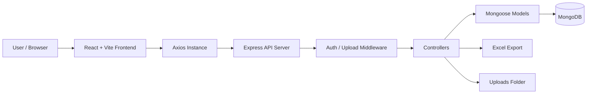

# Expense Management System


<div align="center">
  
</div>

<br />

Expense Management System is a full-stack MERN application that helps users track income, expenses, and overall balance through a responsive dashboard. It demonstrates practical MERN stack development with JWT authentication, RESTful APIs, MongoDB aggregation, protected routes, reusable React components, chart-based analytics, image upload, and Excel export.

This project is portfolio-ready for roles involving full-stack JavaScript, API integration, authentication, responsive UI development, database modeling, and performance-focused dashboard experiences.

## Project Links

| Resource             | Link                                                    |
| -------------------- | ------------------------------------------------------- |
| Live                 | https://expense-management-system-ui-juxs.onrender.com/ |

## Key Features

- Secure user registration and login with JWT-based authentication.
- Password hashing with bcrypt before storing user credentials.
- Protected dashboard, income, expense, and user profile API routes.
- Income management with add, list, delete, and Excel download workflows.
- Expense management with add, list, delete, and Excel download workflows.
- Dashboard summary for total balance, total income, total expenses, recent transactions, last 30 days expenses, and last 60 days income.
- Responsive React UI built with Tailwind CSS and reusable components.
- Visual analytics using Recharts for pie, bar, and line chart presentations.
- Profile image upload using Multer and static file serving from the backend.
- Centralized frontend API handling with Axios interceptors and auth headers.
- Toast notifications and client-side validation for smoother user feedback.

## Tech Stack

| Layer       | Technologies                                                                       |
| ----------- | ---------------------------------------------------------------------------------- |
| Frontend    | React 19, Vite, React Router, Tailwind CSS, Recharts, React Icons, React Hot Toast |
| Backend     | Node.js, Express 5, JWT, bcryptjs, Multer, CORS, dotenv                            |
| Database    | MongoDB, Mongoose                                                                  |
| File Export | xlsx, Excel-compatible downloads                                                   |
| API Client  | Axios with request and response interceptors                                       |
| Tooling     | ESLint, Nodemon, npm                                                               |

## Architecture Explanation

The application follows a clean MERN separation where the React frontend communicates with an Express REST API. The backend validates authentication through middleware, delegates business logic to controllers, and uses Mongoose models to read and write user-specific records in MongoDB.



### API Flow

1. The user logs in or signs up from the React frontend.
2. The backend validates credentials, hashes passwords during registration, and returns a JWT.
3. The frontend stores the token in `localStorage`.
4. The centralized Axios instance attaches `Authorization: Bearer <token>` to protected requests.
5. Express routes call the `protect` middleware to verify the token.
6. Controllers execute business logic and interact with MongoDB through Mongoose models.
7. The API returns JSON data for dashboard charts, transaction lists, and user information.

### Frontend

The frontend is organized around pages, reusable components, hooks, context, and utility modules. Dashboard screens use component composition for cards, charts, transaction lists, modals, and forms.

State management is intentionally lightweight:

- `UserContext` stores the authenticated user and exposes `updateUser` / `clearUser`.
- Page-level state handles income, expenses, loading flags, and modal visibility.
- `useUserAuth` fetches the current user and redirects unauthenticated users.
- `localStorage` persists the JWT between refreshes.

### Backend

The backend uses route-controller-model separation:

- `routes/` maps API URLs to controller functions.
- `controllers/` contains request handling and business logic.
- `models/` defines MongoDB schemas for users, income, and expenses.
- `middleware/` handles JWT protection and image upload.
- `config/` contains database connection logic.

### Database

MongoDB stores user accounts, income records, and expense records. Each income and expense document references `userId`, allowing the API to fetch data per authenticated user.

## Folder Structure

<details>
<summary>View Folder Structure</summary>

```text
Expense-management-system/
+-- backend/
|   +-- config/
|   |   +-- db.cjs
|   +-- controllers/
|   |   +-- authController.cjs
|   |   +-- dashboardController.cjs
|   |   +-- expenseController.cjs
|   |   +-- incomeController.cjs
|   +-- middleware/
|   |   +-- authMiddleware.cjs
|   |   +-- uploadMiddleware.cjs
|   +-- models/
|   |   +-- Expense.cjs
|   |   +-- Income.cjs
|   |   +-- User.cjs
|   +-- routes/
|   |   +-- authRoutes.cjs
|   |   +-- dashboardRoutes.cjs
|   |   +-- expenseRoutes.cjs
|   |   +-- incomeRoutes.cjs
|   +-- uploads/
|   +-- .env.example
|   +-- package.json
|   +-- server.cjs
+-- frontend/
|   +-- public/
|   +-- src/
|   |   +-- assets/
|   |   +-- components/
|   |   +-- context/
|   |   +-- hooks/
|   |   +-- pages/
|   |   +-- utils/
|   |   +-- App.jsx
|   |   +-- index.css
|   |   +-- main.jsx
|   +-- .env.example
|   +-- package.json
|   +-- vite.config.js
+-- README.md
```

</details>

## Installation & Setup

Prerequisites: Node.js 18+, npm, MongoDB (local or Atlas).

1. Clone and install

```bash
git clone <your-repository-url>
cd Expense-management-system
```

2. Backend

```bash
cd backend
npm install
cp .env.example .env
npm run dev
```

3. Frontend (new terminal)

```bash
cd frontend
npm install
cp .env.example .env
npm run dev
```

## Environment Variables

### Backend `.env`

```env
PORT=5000
MONGO_URL=mongodb://127.0.0.1:27017/expense-management-system
JWT_SECRET=replace_with_a_long_random_secret
CLIENT_URL=http://localhost:5173
```

For production, set `CLIENT_URL` to the deployed frontend URL.

### Frontend `.env`

```env
VITE_API_BASE_URL=http://localhost:5000
```

For production, set `VITE_API_BASE_URL` to the deployed backend URL.


## Build and Deployment

### Frontend Deployment

Recommended platforms: Vercel, Netlify, Render Static Site.

```bash
cd frontend
npm run build
npm run preview
```

Deployment settings:

| Setting | Value |
| --- | --- |
| Root directory | `frontend` |
| Build command | `npm run build` |
| Publish directory | `dist` |
| Environment variable | `VITE_API_BASE_URL=<your-backend-url>` |

### Backend Deployment

Recommended platforms: Render, Railway, Fly.io, or a VPS.

Deployment settings:

| Setting | Value |
| --- | --- |
| Root directory | `backend` |
| Install command | `npm install` |
| Start command | `npm start` |
| Environment variables | `PORT`, `MONGO_URL`, `JWT_SECRET`, `CLIENT_URL` |

After deploying the frontend, update backend `CLIENT_URL` so CORS allows requests from the deployed UI.

## API Overview

- Base URL: `http://localhost:5000`
- Auth header: `Authorization: Bearer <jwt_token>`
- Core routes: `/api/v1/auth`, `/api/v1/dashboard`, `/api/v1/income`, `/api/v1/expense`

## Future Improvements

- Budget planning and monthly limits.
- Category trends and richer analytics.
- Recurring transactions.
- Advanced filters and CSV import.
- Dark mode and accessibility enhancements.
- Multi-currency support.

## License

This project is licensed under the MIT License - see the [LICENSE](LICENSE) file for details.
